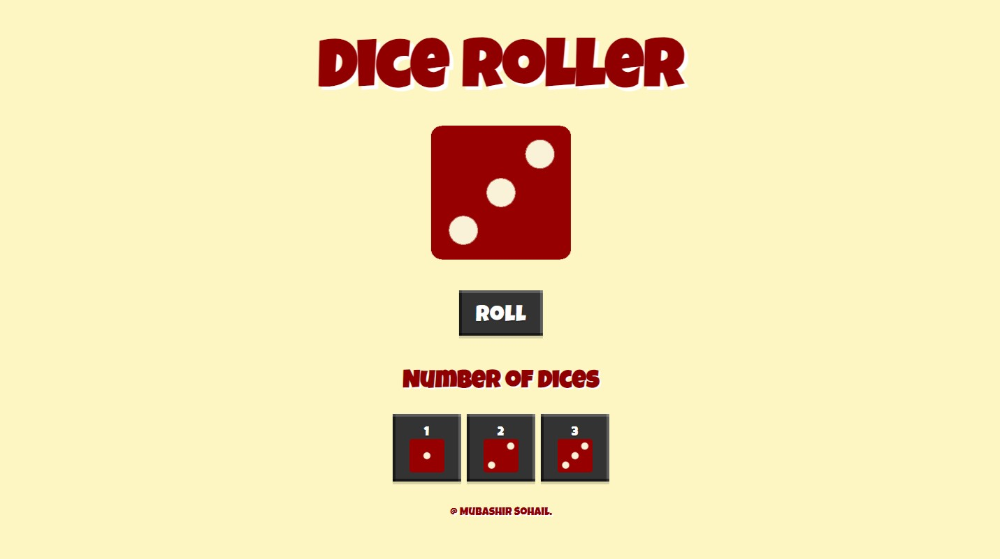
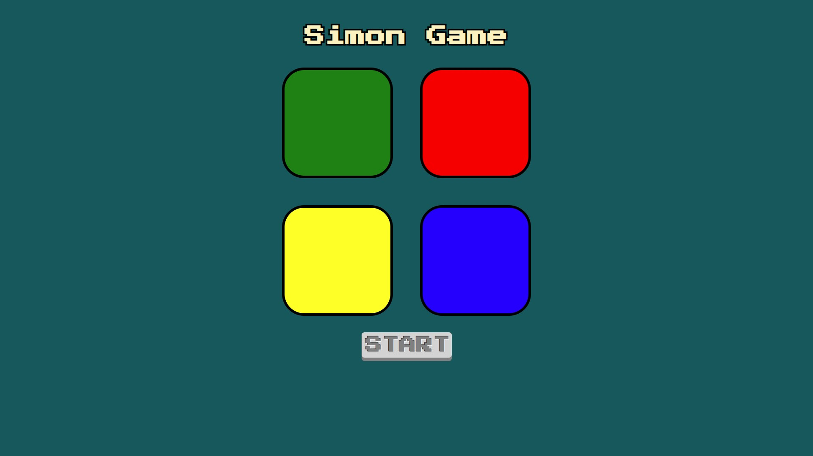

<!-- ## Hi there 👋

**mubashirsohail4/mubashirsohail4** is a ✨ _special_ ✨ repository because its `README.md` (this file) appears on your GitHub profile.

Here are some ideas to get you started:

- 🔭 I’m currently working on ...
- 🌱 I’m currently learning ...
- 👯 I’m looking to collaborate on ...
- 🤔 I’m looking for help with ...
- 💬 Ask me about ...
- 📫 How to reach me: ...
- 😄 Pronouns: ...
- ⚡ Fun fact: ... -->

# 👋 Hi, My name is Mubashir Sohail

🎓 **Computer Science Graduate | Full-Stack Web Developer**

I'm a passionate developer currently pursuing my Bachelor's in Computer Science from the University of Karachi. I enjoy building responsive and user-centric web applications using modern tech stacks and have a strong interest in backend systems, UI/UX, and creative problem-solving. When I'm not coding, you'll likely find me gaming competitively or troubleshooting software and hardware issues.

> “Code is like humor. When you have to explain it, it’s bad.” — *Cory House*

---

## 🚀 Projects

### 🌐 Cryptorate
Real-time cryptocurrency rate checker using **Node.js**, **Express**, **REST API**, and **EJS**, styled with **Bulma CSS** for a clean UI.

 [**Visit Website**](https://cryptorate.vercel.app)  
 [**Visit Github Repository**](https://github.com/mubashirsohail4/cryptorate)

### 📝 CRUDPress
A CRUD-enabled blogging platform built with **Node.js**, **Express**, **EJS**, and **Bootstrap** to manage articles in a PostgreSQL/MongoDB database.

 [**Visit Website**](https://crudpress.vercel.app)  
 [**Visit Github Repository**](https://github.com/mubashirsohail4/crudpress)

### 🎲 Dice Roller
A fun virtual dice roller built with **HTML**, **CSS**, and **JavaScript**.

[**Visit Website**](https://mubashirsohail4.github.io/dice-roller/)  
[**Visit Github Repository**](https://github.com/mubashirsohail4/dice-roller)

### 🧠 Simon Game
A memory-based game made with **JavaScript** and **jQuery**, where users repeat sequences of sounds and lights.

[**Visit Website**](https://mubashirsohail4.github.io/simon-game/)  
[**Visit Github Repository**](https://github.com/mubashirsohail4/simon-game)

---

## 💻 Tech Stack

**Frontend:**  
`React` • `HTML5` • `CSS3` • `JavaScript (ES6+)` • `Bootstrap` • `Tailwind CSS` • `DaisyUI` • `jQuery`

**Backend & Database:**  
`Node.js` • `Express.js` • `EJS` • `MongoDB` • `PostgreSQL` • `SQL` • `REST API`

**Programming Languages:**  
`Java` • `C#` • `C`

**Tools:**  
`Git` • `VS Code` • `Postman` • `OBS Studio` • `Photoshop` • `Premiere Pro` • `Canva`

---

## 📚 Education

🎓 **BS Computer Science** — *University of Karachi* (2021 - 2024)  
📊 CGPA: **3.6**

---

## 📜 Certifications

- **Web Development Bootcamp** – Dr. Angela Yu, Udemy  
- **Java Programming I** – University of Helsinki (MOOC.fi)  
- **Oracle Database Foundations** – LearnQuest, Coursera  
- **SMEC’23-24 eSports Certificate** – Sir Syed University

---

## 🔗 Connect with Me

- [📧 Email](mailto:mubashirsohail4444@gmail.com)  
- [💼 LinkedIn](https://linkedin.com/in/mubashir-sohail)  
- [🖥️ GitHub](https://github.com/mubashirsohail4)

---

## 🎮 Interests

- Competitive eSports & Gaming  
- Computer Hardware Repairing  
- Cybersecurity & Networking  
- Technical Troubleshooting
